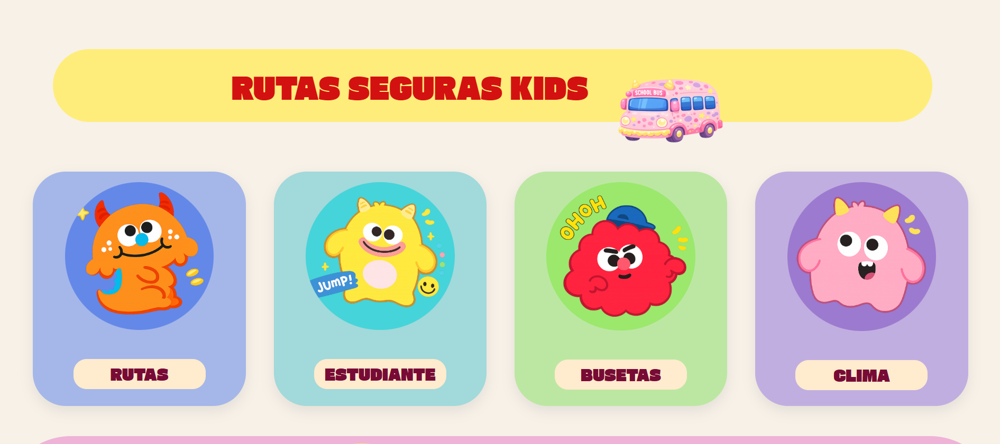
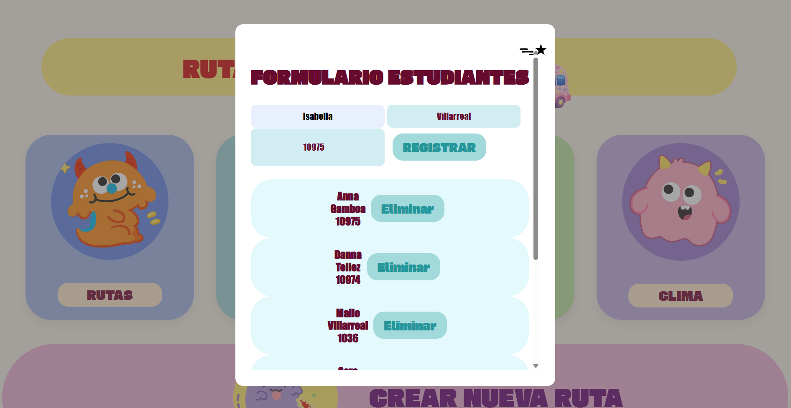
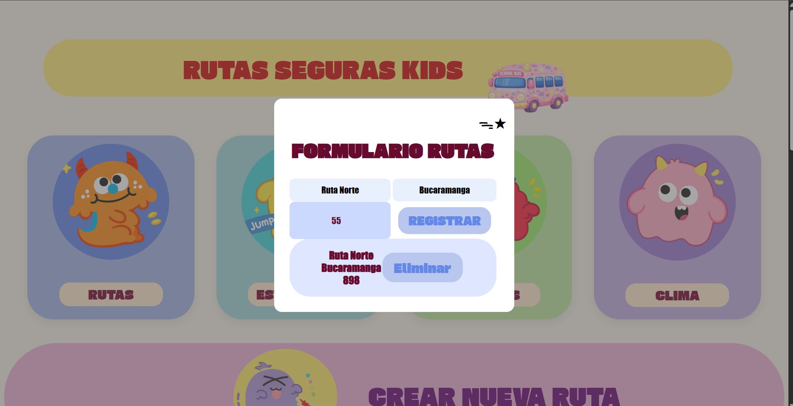
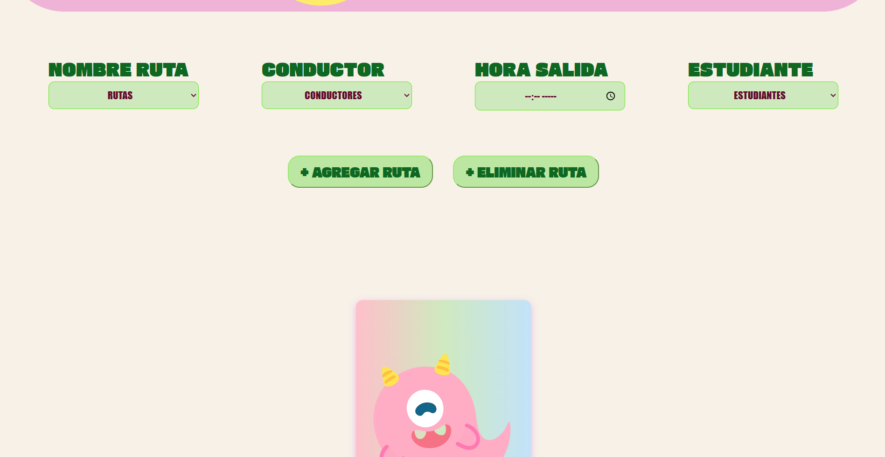
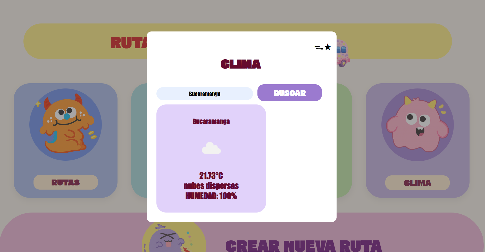

🚍✨ RUTAS SEGURAS KIDS ✨🚍
🌸 Introducción

Rutas Seguras Kids es una página web desarrollada con HTML, CSS y JavaScript que permite administrar rutas escolares de una manera dinámica, 
organizada y visualmente amigable 💗
El proyecto fue creado con una temática infantil y colorida 🎨 para brindar una experiencia más divertida e interactiva al usuario.
Con esta aplicación se pueden registrar:

🚌 Conductores
👧 Estudiantes
🛣️ Rutas escolares
📋 Fichas completas de recorrido
🌦️ Consultas del clima en tiempo real

Además, toda la información queda almacenada utilizando LocalStorage, permitiendo conservar los datos aunque la página se recargue 💾✨

💻 Tecnologías utilizadas

🌷 HTML5
🌷 CSS3
🌷 JavaScript
🌷 LocalStorage
🌷 OpenWeather API
🌷 Web Components

🎨 Diseño del proyecto

El diseño del proyecto fue realizado con una estética:

💖 Infantil
💖 Colorida
💖 Responsive
💖 Moderna
💖 Interactiva

Se utilizaron:

✨ Tarjetas animadas
✨ Modales personalizados
✨ Efectos hover
✨ Tipografías de Google Fonts
✨ Colores pastel

🚌 Funcionalidad: Conductores

En esta sección se pueden registrar los conductores de las rutas escolares 🚍

Permite:

✅ Agregar conductores
✅ Guardar datos automáticamente
✅ Mostrar lista dinámica
✅ Eliminar conductores

  

👧 Funcionalidad: Estudiantes

Esta parte permite registrar estudiantes y guardar su información 📚✨

Permite:

✅ Registrar estudiantes
✅ Guardar nombre, apellido y documento
✅ Mostrar lista de estudiantes
✅ Eliminar estudiantes

  

🛣️ Funcionalidad: Rutas

En esta sección se crean las rutas escolares 🗺️✨

Permite:

✅ Crear rutas
✅ Registrar kilómetros
✅ Registrar ciudad
✅ Eliminar rutas

  

📋 Funcionalidad: Fichas de rutas

Las fichas conectan:

🚌 Ruta
👨‍✈️ Conductor
👧 Estudiante

Permite:

✅ Crear fichas completas
✅ Mostrar hora de salida
✅ Editar información
✅ Eliminar fichas

  

🌦️ Funcionalidad: Clima

La página consume una API de clima utilizando OpenWeather ☁️✨

Permite consultar:

🌡️ Temperatura
💧 Humedad
☀️ Estado del clima
🖼️ Icono dinámico del clima

  

💾 LocalStorage

Toda la información del proyecto se guarda utilizando:

✨ localStorage

Gracias a esto, los datos permanecen guardados incluso si la página se recarga 🔒💕

Se almacenan:

📦 Conductores
📦 Estudiantes
📦 Rutas
📦 Fichas

Y listo ✨🚍💕

👩‍💻 Autora
🌷 Isabella Villarreal 🌷

🎯 Objetivo del proyecto
Este proyecto fue realizado con el objetivo de practicar:

✨ Manipulación del DOM
✨ Eventos
✨ APIs
✨ LocalStorage
✨ Responsive Design
✨ JavaScript moderno
✨ Diseño web
